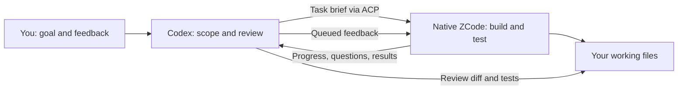

# Codex × ZCode · Tandem

**Codex plans the work. ZCode builds it. You stay in the conversation.**

[简体中文](README.zh-CN.md) · [Install](references/installation.md) · [Examples](docs/examples.md) · [FAQ](docs/faq.md)


Tandem is a **Windows Codex skill for working with native ZCode over ACP (Agent Client Protocol)**. Codex hands off a defined task, follows its progress, asks questions, and sends corrections in the same ZCode session. ZCode uses your own Coding Plan to do the implementation and testing; Codex reviews the result.

If you already use both tools and keep copying requirements and results between them, this project gives that handoff a repeatable shape.

**Windows · Node 24.19.0 · ACP 0.65.1 · MIT**

## What it helps with

**New in 1.1:** file ownership and reviewed command grants, source-bound test receipts, separate queue/execution timing, visible startup fallback warnings, and a compact handoff. Existing edit/execute requests need a `workspace` declaration; read the [upgrade guide](references/execution-safety.md). Model completion and test acceptance are reported separately.

**New in 1.2:** read-only native identity checks include Desktop/CLI/ACP versions and SHA256, with a local baseline recorded only by a successful connection probe. Quota summaries show actual GLM windows and reset times while preserving unavailable states. Windows diagnostics give tool paths; the upstream POSIX login-shell fallback remains visible.

- **A feature with clear boundaries.** Let ZCode implement and test one module while Codex keeps track of the broader requirement.
- **A task that needs course corrections.** Inspect progress, ask what is blocking the work, or queue a changed requirement without starting the conversation over.
- **A second opinion on a change.** Start a separate ZCode review session with the original requirement and actual candidate.
- **Work with several dependent parts.** Use native workflow actors, joins, saved node results, and explicit resume when those capabilities are useful.

For a one-line edit, a direct edit in Codex may be simpler. Tandem is most useful when a handoff is worth keeping track of.

## Start here

You need Codex with skills support, a separately installed and signed-in [ZCode](https://zcode.z.ai/), Git, and **Node 24.19.0**. The current connection baseline is ZCode Desktop **3.14.5.7961** / CLI **0.16.9**. Other identities need their own connection and task checks.

In PowerShell, choose a directory you will keep, then run:

```powershell
git clone https://github.com/linxiangpk1991/codex-zcode-tandem.git
Set-Location codex-zcode-tandem
node.exe --version
npm.cmd ci --prefix runtime --ignore-scripts --no-audit --no-fund
node.exe scripts/setup.mjs
```

If ZCode is installed in a custom location:

```powershell
node.exe scripts/setup.mjs --zcode-bin 'D:/Apps/ZCode/resources/glm/zcode.cjs'
```

The installer creates a small skill entry at `~/.agents/skills/codex-zcode-tandem`. It points to this checkout, so keep the checkout in place. Reload skills or open a new Codex chat, then try:

> $codex-zcode-tandem Ask ZCode to inspect the input validation in this project. Read only. Identify one reproducible bug and the smallest useful test. Review the evidence before changing code.

[The installation guide](references/installation.md) covers the connection probe, existing installations, custom paths, updates, and rollback. You use your own ZCode account; this repository includes no subscription or login information.

## How the collaboration works



| During a task | What actually happens |
| --- | --- |
| Check status | Read the local progress snapshot without a model call. |
| Ask or steer | Queue a message for a safe foreground turn boundary, before the next planned phase. |
| Answer a question | Reply to the exact pending question using one of its offered options. |
| Pause | Cancel the foreground turn and stop the invocation's bound workflow. Completed writes remain. |
| Resume | Read back the saved session and workflow state, then continue unfinished work. |
| Change workflow concurrency | Set a bound run's limit from 1 to 4 and confirm the native event. |
| Amend a workflow | Review the new script, bind the predecessor run, and check which nodes were reused. |

**Feedback is queued, not injected into a tool call already in progress.** A running background actor needs an explicit workflow amendment or a pause/readback/resume cycle to change its instructions. See [live control](references/live-control.md) and [native workflows](references/native-workflows.md).

Core implementation and independent review default to **GLM-5.3**; smaller tasks can use **GLM-5.3-Flash**. Both default to `thought=max`. Your selected Codex controller model stays unchanged.

## What you get

A self-contained skill, an installer, a pinned ACP adapter, structured progress and results, and offline regression tests. There is no additional dashboard or hosted control service to operate. The local adapter calls the native ZCode engine; model inference still uses ZCode's service and your account.

The public skill name is **`codex-zcode-tandem`**. It has its own installation entry and does not replace a separately installed `zcode-native` skill. Public changes have their own Git history and versioning.

## Know the limits

Windows is the supported platform. macOS and Linux have not been validated and are rejected by the current launcher. Tool permission checks are **not an OS sandbox**. A resumed native session can omit workflow permission callbacks; observing tool input cannot undo an action.

A completion flag is evidence about a run, not proof that a feature works. Review the diff and relevant tests. A timeout, lost connection, or pause does not reverse file changes or unknown external effects. The configured 90-minute deadline is not a 90-minute endurance-test result.

There is no automatic paid-API fallback, account sharing, or machine-wide quota-resume watcher. See [verification and limitations](references/acceptance.md) and [security](SECURITY.md).

## Read more

| I want to… | English | 简体中文 |
| --- | --- | --- |
| Install or troubleshoot | [Installation](references/installation.md) | [安装与排障](references/installation.zh-CN.md) |
| Try realistic tasks | [Examples](docs/examples.md) | [使用场景](docs/examples.zh-CN.md) |
| Follow and steer work | [Live control](references/live-control.md) | [实时控制](references/live-control.zh-CN.md) |
| Use parallel work or recovery | [Workflows](references/native-workflows.md) | [原生工作流](references/native-workflows.zh-CN.md) |
| Write a useful brief | [Task briefs](references/worker-prompts.md) | [委派模板](references/worker-prompts.zh-CN.md) |
| Understand the code | [Architecture](references/project-map.md) | [项目结构](references/project-map.zh-CN.md) |
| Check support and evidence | [Verification](references/acceptance.md) | [验收范围](references/acceptance.zh-CN.md) |
| Find a quick answer | [FAQ](docs/faq.md) | [常见问题](docs/faq.zh-CN.md) |

For assistants reading this repository, start with [llms.txt](llms.txt) for the documentation map and [SKILL.md](SKILL.md) for operating instructions. Neither file grants permission to act on another project.

## Contribute and license

Bug reports with a small reproducible case are welcome in English or Chinese. Read [contributing](CONTRIBUTING.md) before changing runtime behavior. Documentation corrections are useful too.

Tandem's code and documentation are [MIT licensed](LICENSE). ZCode and third-party dependencies retain their own terms. This is an independent community project, not an official OpenAI or Z.ai product.

Built on [zcode-acp](https://github.com/william0wang/zcode-acp) and the native ZCode engine. [Changelog](CHANGELOG.md) · [Asset credits](assets/README.md)
