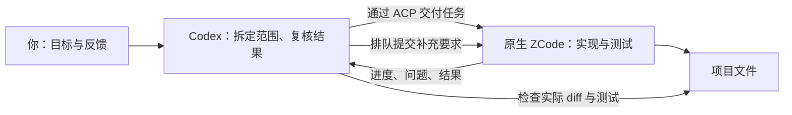

# Codex × ZCode · Tandem

**Codex 负责统筹，ZCode 负责执行，你可以随时跟进。**

[English](README.md) · [安装指南](references/installation.zh-CN.md) · [使用场景](docs/examples.zh-CN.md) · [常见问题](docs/faq.zh-CN.md)


Tandem 是一个 **Windows 上的 Codex 技能，通过 ACP（Agent Client Protocol）与原生 ZCode 协作**。Codex 把范围明确的任务交给 ZCode，查看进展、追问、提出修改建议；ZCode 使用你自己的 Coding Plan 完成实现和测试，最后由 Codex 检查结果。

如果你已经在用这两个工具，经常来回复制需求、补充背景、搬运结果，Tandem 可以把这段协作接起来。

**Windows · Node 24.19.0 · ACP 0.65.1 · MIT 开源**

## 它能帮你做什么

- **把一个模块交出去。** 让 ZCode 完成明确范围内的实现和测试，Codex 继续把握整体需求。
- **做着做着，需要调整。** 查看当前进展，询问卡在哪里，或补充新要求，不必每次重开会话。
- **找另一位执行者审查。** 让独立的 ZCode 会话检查原始需求和实际代码，而不只看实现者的总结。
- **处理有依赖的多步骤任务。** 有需要时使用原生并行角色、依赖汇合、节点结果保存和中断恢复。

改一行文案，直接让 Codex 改通常更省事。任务值得委派、而且需要跟进时，Tandem 才更有用。

## 开始使用

准备好支持技能的 Codex、单独安装并登录的 [ZCode](https://zcode.z.ai/)、Git，以及 **Node 24.19.0**。已验证的原生版本是 ZCode 桌面 **3.14.4.7912** / CLI **0.16.9**；其他版本需要先检查连接和实际任务。

选一个准备长期保留的目录，在 PowerShell 中执行：

```powershell
git clone https://github.com/linxiangpk1991/codex-zcode-tandem.git
Set-Location codex-zcode-tandem
node.exe --version
npm.cmd ci --prefix runtime --ignore-scripts --no-audit --no-fund
node.exe scripts/setup.mjs
```

如果 ZCode 安装在自定义目录：

```powershell
node.exe scripts/setup.mjs --zcode-bin 'D:/Apps/ZCode/resources/glm/zcode.cjs'
```

安装器在 `~/.agents/skills/codex-zcode-tandem` 创建一个很小的技能入口，指向当前源码目录，因此安装后请保留源码。重新加载技能或打开新的 Codex 聊天，然后试试：

> $codex-zcode-tandem 让 ZCode 检查这个项目的输入校验。只读，找出一个可以复现的问题和最小测试方法。先复核证据，再决定是否修改代码。

[安装指南](references/installation.zh-CN.md) 包含连接探针、已有安装、自定义路径、更新和回退。你使用自己的 ZCode 账号；仓库不提供订阅或登录资料。

## 协作是怎么进行的



| 你想做的事 | 实际执行方式 |
| --- | --- |
| 看进度 | 直接读取本地进度，不消耗一次模型推理。 |
| 追问或纠偏 | 消息进入队列，在安全的前台回合边界、下一个计划阶段之前处理。 |
| 回答问题 | 对准确的问题标识，选择原生引擎提供的选项。 |
| 暂停 | 取消前台回合并停止本次绑定的工作流，已完成的写入会保留。 |
| 续接 | 先读回保存的会话与工作流状态，再继续未完成部分。 |
| 调整工作流并发 | 将指定运行的上限设为 1 到 4，并核对原生事件。 |
| 修订工作流 | 审查新脚本、绑定前序运行，再检查哪些节点被复用。 |

**补充要求会排队，不会插进正在执行的工具调用。** 已经启动的后台角色，需要明确修订工作流，或暂停、读回后续接，才能改变要求。详见[实时控制](references/live-control.zh-CN.md)和[原生工作流](references/native-workflows.zh-CN.md)。

核心实现与独立审查默认使用 **GLM-5.3**，小任务可选 **GLM-5.3-Flash**，两者默认 `thought=max`。你当前选择的 Codex 总控模型保持不变。

## 安装包里有什么

技能说明、安装器、锁定版本的 ACP 适配器、结构化进度和结果，以及离线回归测试。不需要再部署一个控制后台。适配器在本机调用原生 ZCode，引擎推理仍使用 ZCode 的服务和你的账号。

公开版技能名为 **`codex-zcode-tandem`**，使用独立入口，不替换另外安装的 `zcode-native`。公开版有自己的 Git 历史和版本节奏。

## 使用前了解这些边界

当前支持 Windows。macOS 和 Linux 尚未验收，启动器会拒绝运行。工具权限检查**不等于操作系统沙箱**；恢复的原生会话可能省略工作流权限回调，事后观察工具输入也无法撤销已经发生的动作。

运行显示完成，还要看实际 diff 和相关测试。超时、断连或暂停不会自动回滚文件及外部写入。配置了 90 分钟时限，也不代表完成了 90 分钟耐久测试。

不自动切换付费 API，不共享账号，也不启用机器级额度恢复监视器。详见[验收范围](references/acceptance.zh-CN.md)和[安全说明](SECURITY.md#简体中文)。

## 文档导航

| 我想了解 | 简体中文 | English |
| --- | --- | --- |
| 安装、更新、排障 | [安装指南](references/installation.zh-CN.md) | [Installation](references/installation.md) |
| 实际任务怎么提 | [使用场景](docs/examples.zh-CN.md) | [Examples](docs/examples.md) |
| 查询、追问、暂停 | [实时控制](references/live-control.zh-CN.md) | [Live control](references/live-control.md) |
| 并行与恢复 | [原生工作流](references/native-workflows.zh-CN.md) | [Workflows](references/native-workflows.md) |
| 给 ZCode 写任务要求 | [委派模板](references/worker-prompts.zh-CN.md) | [Task briefs](references/worker-prompts.md) |
| 源码结构 | [项目结构](references/project-map.zh-CN.md) | [Architecture](references/project-map.md) |
| 哪些能力经过验证 | [验收范围](references/acceptance.zh-CN.md) | [Verification](references/acceptance.md) |
| 快速查找答案 | [常见问题](docs/faq.zh-CN.md) | [FAQ](docs/faq.md) |

AI 阅读本项目时，可以从 [llms.txt](llms.txt) 找到文档，从 [SKILL.md](SKILL.md) 读取操作规则。这些文件不代表用户授权你操作其他项目。

## 参与和许可

欢迎用中文或英文提交包含复现方法的问题。修改运行逻辑前请读[贡献指南](CONTRIBUTING.md#简体中文)，修正文档也很有帮助。

项目代码与文档采用 [MIT 许可证](LICENSE)。ZCode 和第三方依赖遵循各自条款。本项目由社区独立维护，并非 OpenAI 或 Z.ai 的官方产品。

依托 [zcode-acp](https://github.com/william0wang/zcode-acp) 与原生 ZCode 引擎构建。[更新记录](CHANGELOG.md) · [图片来源](assets/README.md)
